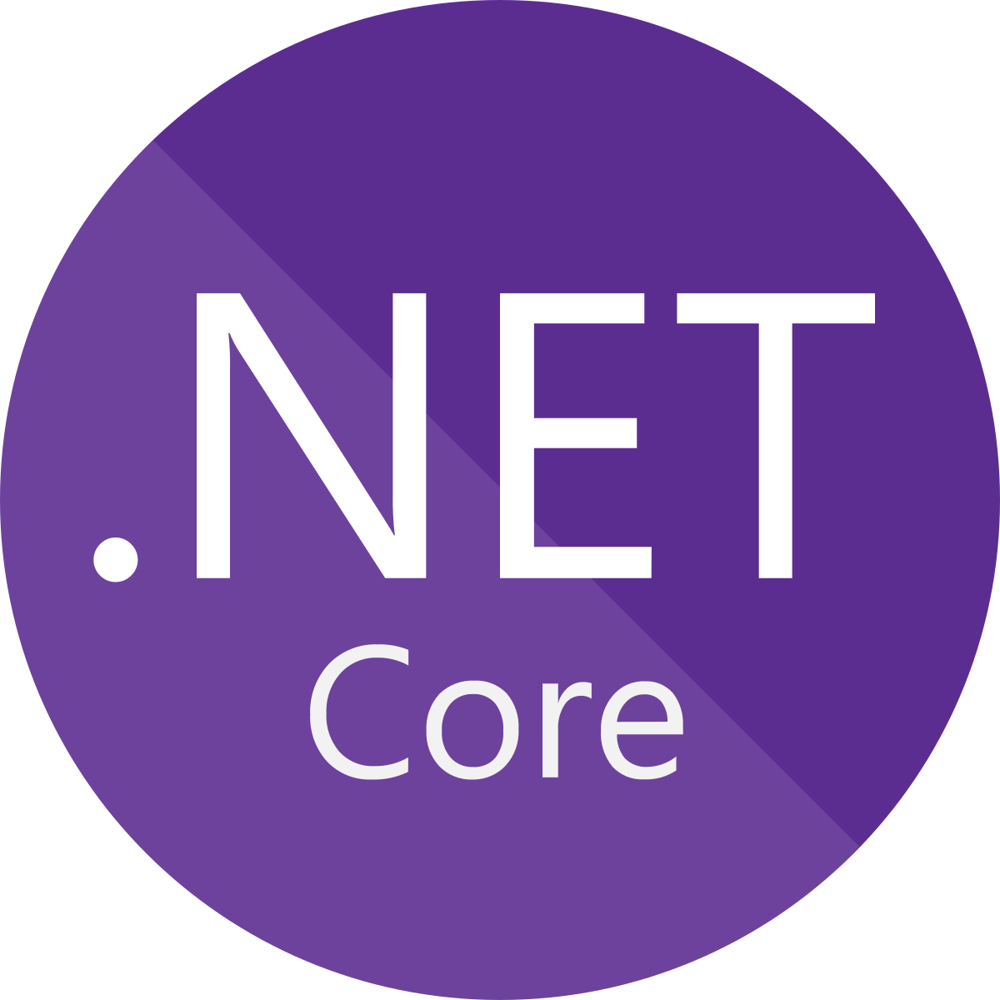

<h3>📲 Contact Details</h3>

 

Feel free to contact me on the above platforms

I'm an avid enjoyer of C# and mainly create various projects for myself then share them so that others may benefit from them as I have.

  

	<!-- Table -->
	<table align="right">
		<tr>
			<th>Lang</th>
			<th>Repository</th>
			<th>Stars</th>
			<th>Forks</th>
			<th>Downloads</th>
		</tr>
<!-- Paste Zone -->
	<!-- MuMu_RichPresence -->
	<tr>
		<td>
			
		</td>
		<td>
			
		</td>
		<td>
			
		</td>
		<td>
			
		</td>
		<td>
			
		</td>
	</tr>
	<!-- PlayGames_RichPresence -->
	<tr>
		<td>
			
		</td>
		<td>
			
		</td>
		<td>
			
		</td>
		<td>
			
		</td>
		<td>
			
		</td>
	</tr>
	<!-- PostProcessing -->
	<tr>
		<td>
			
		</td>
		<td>
			
		</td>
		<td>
			
		</td>
		<td>
			
		</td>
		<td>
			
		</td>
	</tr>
	<!-- MicSensitivity -->
	<tr>
		<td>
			
		</td>
		<td>
			
		</td>
		<td>
			
		</td>
		<td>
			
		</td>
		<td>
			
		</td>
	</tr>
	<!-- ToggleMicIcon -->
	<tr>
		<td>
			
		</td>
		<td>
			
		</td>
		<td>
			
		</td>
		<td>
			
		</td>
		<td>
			
		</td>
	</tr>
	<!-- GoZippy -->
	<tr>
		<td>
			
		</td>
		<td>
			
		</td>
		<td>
			
		</td>
		<td>
			
		</td>
		<td>
			
		</td>
	</tr>
	<!-- DeathMustDieMods -->
	<tr>
		<td>
			
		</td>
		<td>
			
		</td>
		<td>
			
		</td>
		<td>
			
		</td>
		<td>
			
		</td>
	</tr>
	<!-- Win11_Tooltip_Fix -->
	<tr>
		<td>
			
		</td>
		<td>
			
		</td>
		<td>
			
		</td>
		<td>
			
		</td>
		<td>
			
		</td>
	</tr>
	<!-- ConsoleEncodingFix -->
	<tr>
		<td>
			
		</td>
		<td>
			
		</td>
		<td>
			
		</td>
		<td>
			
		</td>
		<td>
			
		</td>
	</tr>
	<!-- ToggleUIStickers -->
	<tr>
		<td>
			
		</td>
		<td>
			
		</td>
		<td>
			
		</td>
		<td>
			
		</td>
		<td>
			
		</td>
	</tr>
	<!-- ResizePls -->
	<tr>
		<td>
			
		</td>
		<td>
			
		</td>
		<td>
			
		</td>
		<td>
			
		</td>
		<td>
			
		</td>
	</tr>
<!-- End Paste Zone -->
	</table>
	<h3 align="left">🛠 Tech Stack</h3>
	<kbd align="left">
		<kbd>Back-end</kbd>
		 
		 
		
		
		
	</kbd>
	<kbd>
		<kbd>Library/FrameWorks</kbd>
		 
		 
		
		
		
	</kbd>
	 
	<kbd>
		<kbd>Terminal Scripts</kbd>
		 
		 
		
		
		
	</kbd>
	<kbd>
		<kbd>OS</kbd>
		 
		 
		
		
	</kbd>
	 
	<kbd>
		<kbd>Tools</kbd>
		 
		 
		
		
		
		
		
		
	</kbd>

 

<!--  -->
